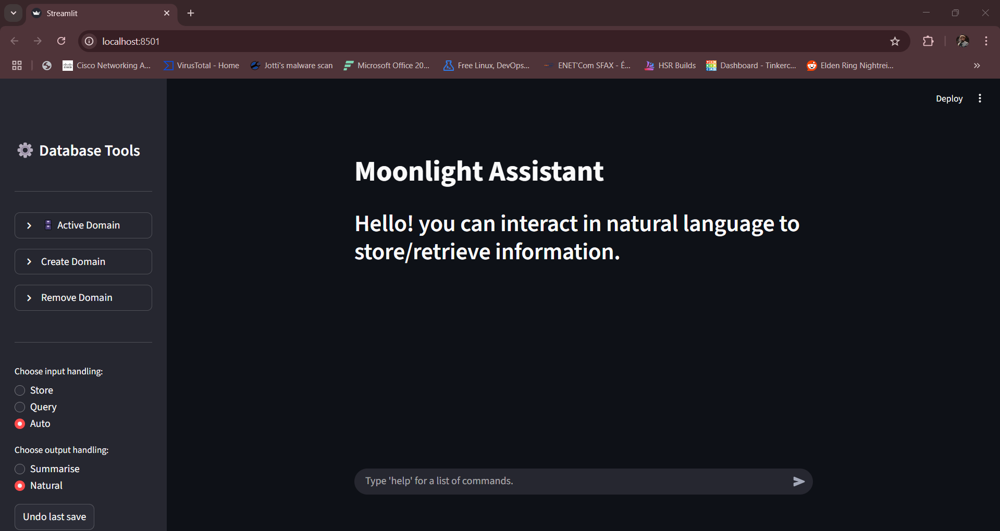
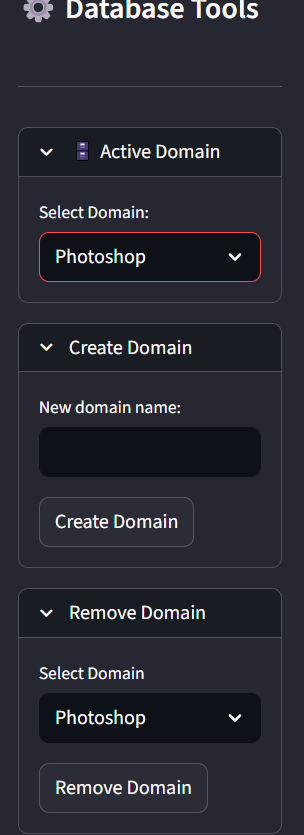

# Moonlight
RAG-based chatbot that acts as a student's second memory to help memorize learned information.

## Use
Interact in natural language to store information inside a vector database, Retrieve it later by asking questions in natural language, It summarises the result to match your phrasing.

## Tech Stack
-Streamlit for simple web interface
-Qdrant vector database for semantic similarity search
-BAAI/bge-m3 for high dimensional text embedding and dense/sparse vector embedding
-Microsoft Phi-3-mini-4k-instruct for small scale summarisation
-MoritzLaurer/deberta-v3-large for Zero-Shot text routing 

## Setup
1. Install dependencies: pip install -r requirements.txt
2. Start Qdrant Locally (use docker)
3. Run the app: streamlit run moonlightdemo.py

## Current Limitations
-Minimum 4GB VRAM Required
-Processes text only, no document uploads yet
-local LLM, response quality is limited 

## Why i built this
I started this project because i saw that while learning new things, i could not possibly remember every step that i took and every information that i learned and the thought process that led me to understand things, i needed something that reminded me of my own knowledge after learning it, Online AI Chatbots would give a general explanation, however what really is valuable is how you would explain it to yourself.

## Technical decisions
-Did not stick to the full haystack framework for more freedom, Haystack's QdrantDocumentStore is tied to a single index parameter which is essentially the "collection", using the raw QdrantClient provided more control over having multiple collections in one initialised Database.
-Used Zero-Shot text routing to classify user information and question into pre-defined metadata tags for faster workflow.
-used dense+sparse vector embedding given that users typically know a few keywords about information they're searching, and the fact that retrieve queries will, 100% of the time, be differently shaped than their counterpart store query,  making sparse weights extremely important in adding value to information where unique keywords are used.
-Decided the use the LLM for only the summrisation task and cut corners with other nodes where the LLM could potentially prove to be better, given that with my current hardware limitations, the text generation from the LLM takes a while.
-Ran everything locally given that the LLM's part in the system could be completed with local models and does not require a too-sophisticated model.

## Future technical goals
-Utilise Qdrant's metadata soft and hard filtering mechanics
-More features for "Progress" including Summarising progress by date and giving a general summary.
-Experimenting with the LLM's capabilities to replace critical parts (Choosing the correct answer from the top_k retrieved answers based on the user's query, Choosing appropriate metadata tags for the store query..)
-Ability to process very long text documents by chunking them

## What i learned
-How vector databases and RAG pipelines work.
-Prompt engineering for both LLM's and Zero-Shot text routers.
-Details about the use of every node in the pipeline.
-Evaluating and iterating on Zero-Shot classification labels using precision/recall metrics
-Tradeoffs of local LLM inference on limited hardware
-Manually designing a retrieval pipeline with hybrid dense+sparse search

## Evaluations
OVERALL EVALUATION (Did the system retrieve the correct text?)
 On a dataset of 150 biology-related facts, 25 of queries did not retrieve the correct text.
 Store/Retrieve routing: 0.89
 Store topic routing: 0.92
 Retrieve topic routing: 0.84
 End-to-end retrieval: 0.83

### Detailed accuracy scores 
Store/Retrieve Routing — 0.89 accuracy
[[43  7]
 [ 4 46]]

 Store Topic Routing — 0.92 accuracy
                 precision    recall  f1-score   support
        General       0.93      0.82      0.88        34
Troubleshooting       0.97      1.00      0.99        33
       Progress       0.86      0.94      0.90        33

[[28  1  5]
 [ 0 33  0]
 [ 2  0 31]]

 Retrieve Topic Routing — 0.84 accuracy
                 precision    recall  f1-score   support
        General       0.65      0.97      0.78        33
Troubleshooting       0.89      0.73      0.80        33
       Progress       0.96      0.68      0.79        34

[[32  1  0]
 [ 8 24  1]
 [ 9  2 23]]

 ## Known issues
 -Retrieval accuracy drops when information is semantically similar and relating to the same topic
 -Reranking by metadata tags requires a larger database
 -slow response time
 -Phi-3 summarisation, most of the time, ruins the answer's quality, but given that the project is more about the architecture than the components' quality, i decided to keep it optional.

## Priorities
-I tried to prioritise user experience over anything else, in an attempt to let the user interact with the chatbot in natural language like any other AI.
-Prioritised data security by keeping everything local.

## Screenshots

